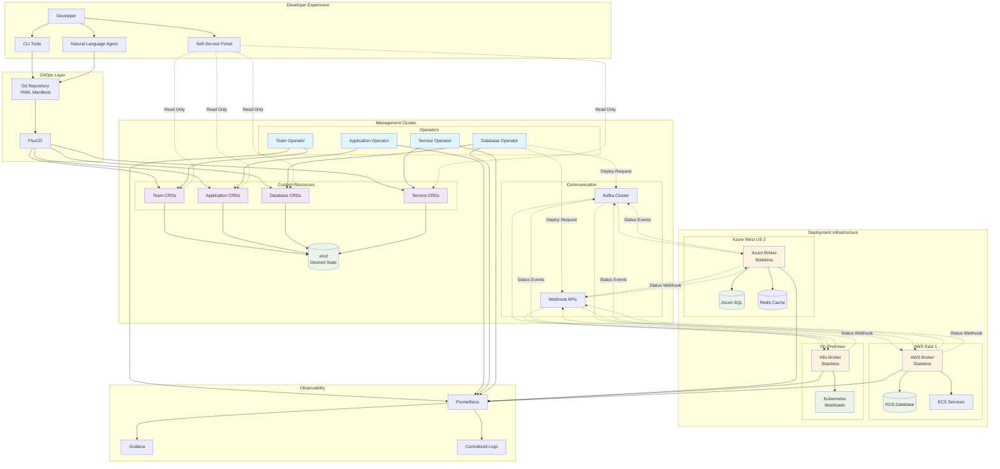

# Kubernetes-Native Internal Developer Platform (KIDP)

## Core Philosophy

Instead of building custom APIs and state management, leverage Kubernetes as the foundation:
- **Operators over APIs**: Use K8s operators instead of custom REST APIs
- **Manifests over API calls**: Declarative YAML instead of imperative API calls
- **Built-in state management**: Let etcd handle desired state, no custom databases
- **Native dependency resolution**: Use K8s reconciliation loops, no custom DAGs

## Architecture Diagram



## Key Architectural Flows

### 1. Resource Creation Flow
```
Developer → Git → FluxCD → CRD → Operator → Broker → Cloud Resource
```

### 2. Status Update Flow  
```
Cloud Resource → Broker → Kafka/Webhook → Operator → CRD Status
```

### 3. Relationship Discovery
```
Application CRD → Label Selector → Database CRD → Connection Secret
```

## Architecture Overview

### Management Cluster
- **Central control plane** running all operators and storing all resource state
- **Single source of truth** for all platform resources and their relationships
- **GitOps integration** via FluxCD for version-controlled infrastructure
- **Stateful** - maintains all deployment state and relationship graphs

### Deployment Brokers
- **Stateless workers** that execute deployments on specific cloud providers/regions
- **Cloud-specific logic** (Azure PaaS, AWS RDS, GCP CloudSQL, etc.)
- **Event-driven communication** back to management cluster
- **Multiple communication channels**: Kafka (primary) + Webhooks (fallback)

### Deployment Targets
- **Logical destinations** where resources get deployed
- **Region/environment specific** (azure-westus2-prod, aws-east1-staging)
- **Broker assignment** - each target served by appropriate broker type

## Core Resource Model

### Resource Types
- **Team**: Identity and ownership boundary
- **Application**: Deployment unit, contains multiple services
- **Service**: Individual microservice within an application
- **Database**: Managed database instances
- **Cache**: Redis/Memcached instances
- **Topic**: Kafka topics and queues
- **Secret**: Sensitive configuration data

### Relationship Model (Hybrid)

**Ownership: Explicit 1:N (Governance)**
```yaml
spec:
  owner:
    kind: Application
    name: user-service
    namespace: team-backend
```
- Immutable after creation
- Used for billing, lifecycle management, approvals
- Clear accountability and governance

**Usage: Labels/Selectors N:N (Runtime)**
```yaml
metadata:
  labels:
    database.platform.company.com/type: postgresql
    database.platform.company.com/environment: production
spec:
  dependencies:
    databaseSelector:
      matchLabels:
        database.platform.company.com/type: postgresql
```
- Dynamic discovery and binding
- Flexible, evolving relationships
- Decoupled deployment lifecycles

## Communication Architecture

### Dual-Mode Broker Communication

**Primary: Kafka**
- Event sourcing for all deployment status
- Natural durability and replay capabilities
- Handles network partitions gracefully
- Topics: `deployment-requests`, `deployment-status`

**Fallback: Webhooks**
- Direct HTTP calls when Kafka unavailable
- Immediate feedback for urgent deployments
- JWT authentication with broker identity claims

### Authentication Strategy
- **Webhooks**: JWT tokens with broker identity and scopes
- **Kafka**: mTLS certificates with automatic rotation
- **Management Cluster APIs**: Same JWT pattern for broker→cluster calls

## State Management Pattern

### Stateless Brokers + Centralized State
- **Brokers**: No local persistence, pure execution engines
- **Management Cluster**: Transactional outbox pattern for reliable status updates
- **Reconciliation**: Operators handle retries, error recovery, drift detection

```yaml
apiVersion: platform.company.com/v1
kind: DeployableResource
status:
  phase: pending|deploying|ready|failed
  conditions:
  - type: Deployed
    status: "True"
  - type: StatusReported  
    status: "False"  # Outbox: retry needed
    reason: "PendingWebhookRetry"
```

## Developer Experience

### GitOps-First
- All changes via Git commits
- FluxCD syncs desired state to management cluster
- Version control for all infrastructure decisions
- Natural rollback and audit trail

### Multi-Modal Interface
- **YAML Manifests**: Direct K8s-style resource definitions
- **CLI Tooling**: Generate and validate manifests
- **Natural Language Agent**: Intent → Manifest generation
- **Self-Service Portal**: Read-only observation, never direct state mutation

### Paved Paths
- **Service Archetypes**: Pre-configured templates for common patterns
- **Best Practice Enforcement**: Via validation webhooks and policies
- **Dependency Discovery**: Automatic resource relationship suggestions

## Policy & Security

### Policy as Code
- **CEL expressions** for policy rules
- **Separation of policy from execution**
- **OPA/Gatekeeper integration** for validation

```yaml
apiVersion: platform.company.com/v1
kind: Policy
spec:
  selector:
    resourceTypes: [Database]
    matchLabels:
      environment: production
  rules:
  - name: require-backup
    expression: "spec.backup.enabled == true"
```

### Enterprise Security
- **RBAC**: K8s native role-based access control
- **Identity Integration**: Corporate SSO/LDAP
- **Network Policies**: Secure broker communication
- **Audit Logging**: All changes tracked via K8s audit logs

## Observability

### Built-in Monitoring
- **Prometheus**: Metrics for all operators and brokers
- **Grafana**: Dashboards for platform health and resource status
- **K8s Events**: Native event streaming for all state changes
- **Distributed Tracing**: Request flows across brokers and clusters

### Cost & Resource Tracking
- **Resource Attribution**: Via ownership relationships
- **Cross-cloud Cost Aggregation**: Broker-reported usage metrics
- **Chargeback Automation**: Team-level cost allocation

## Key Innovations

1. **K8s as Platform Foundation**: No custom state management or APIs needed
2. **Hybrid Relationship Model**: Explicit ownership + dynamic usage via labels
3. **Stateless Broker Pattern**: Centralized state with distributed execution
4. **GitOps-Native**: Version control built into the architecture
5. **Natural Language Integration**: AI agent replaces traditional UIs over time

## Implementation Phases

**Phase 1**: Core operators (Team, Application, Database)

**Phase 2**: Deployment brokers and multi-cloud support  

**Phase 3**: Advanced policies and governance

**Phase 4**: Natural language agent and advanced developer experience
